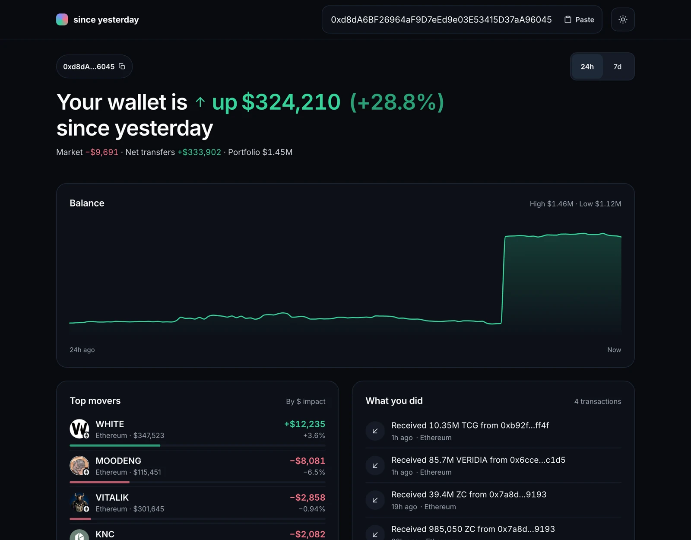

# onchain-digest

A 24-hour wallet digest built with the Zerion API.



## Why

Portfolio trackers answer "what do I own". People who open their wallet in the morning usually want
something else: **what changed since yesterday, and why**. This page answers that in about five seconds:

- one sentence with the change, in dollars and percent;
- whether that change came from the market or from money moving in and out;
- the few positions that actually moved the needle, ranked by dollar impact;
- what the wallet did, in plain English ("Swapped 0.5 ETH → 1,200 USDC on Uniswap").

It is read-only: paste any EVM or Solana address, no wallet connection, no signing.

## Run it

Requirements: Node 20+, pnpm 10.

```bash
pnpm install
cp .env.example .env.local
```

Get a key at [dashboard.zerion.io](https://dashboard.zerion.io) and put it in `.env.local`:

```bash
# .env.local
ZERION_API_KEY=zk_...
```

```bash
pnpm dev   # http://localhost:3000
```

Try the example wallets on the start screen.

The key is only read by the Next.js API routes and never reaches the browser. The demo tier allows 1 request
per second and 300 per day, so the server queues requests and caches responses for 5 minutes.

```bash
pnpm lint && pnpm typecheck
```

## Key product decisions

- **Movers are ranked by dollar contribution, not by percentage.** A $5 token up 80% matters less than
  $10,000 of ETH up 3%.
- **The headline says why, not just how much.** Zerion's 24h change includes transfers. On vitalik.eth it
  reads +27% on a day every asset he holds fell, because a large token arrived. The line under the headline
  splits it into _Market_ and _Net transfers_.
- **Nothing blanks while you look at it.** Every block loads, fails and retries on its own. Switching
  24h ↔ 7d keeps the old data on screen, dimmed, until the new data arrives, and then the chart line and the
  numbers morph into place.
- **Spam and dust are hidden, and the page says so.** Positions under $1 or without a price never become
  movers, and incoming dust airdrops are removed from the activity with a "14 dust transfers hidden" note.

More in [`docs/decisions.md`](docs/decisions.md). API findings (real limits, response quirks) are in
[`docs/api-notes.md`](docs/api-notes.md).

## Stack

Next.js (Pages Router) · TypeScript strict · TanStack Query · styled-components + styled-tools ·
framer-motion · visx · Zod. The code follows a Feature-Sliced layout: `pages` → `widgets` →
`features` → `shared`. All Zerion access lives in `src/shared/server`.

## What I'd add next

- **Real-time updates.** Zerion webhooks push new transactions, so the digest refreshes while it's open.
- **Notifications.** A morning summary ("You're down $312, mostly ETH") as a push or email.
- **Several wallets.** One digest across a user's wallets, using Zerion's wallet-set endpoints.
- A share card: an OG image of the headline for a wallet's day.
